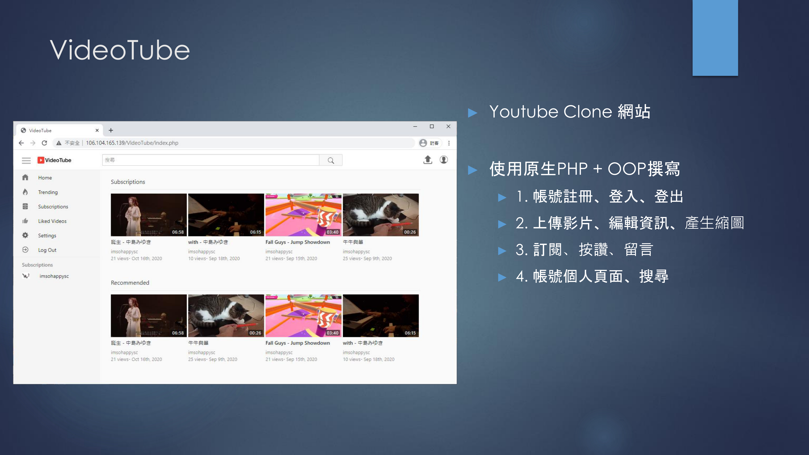
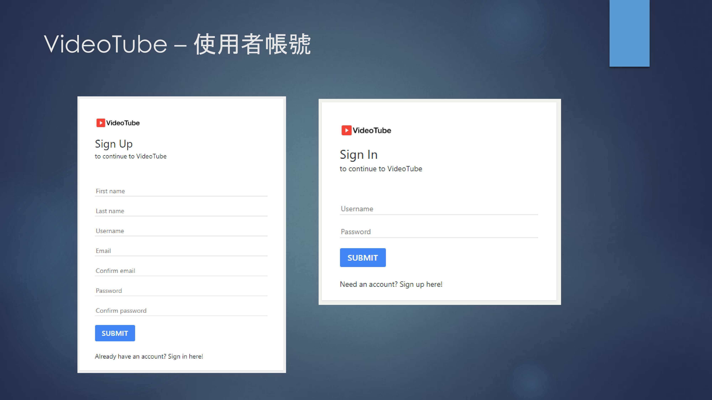
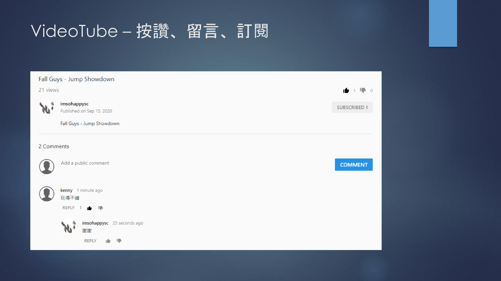
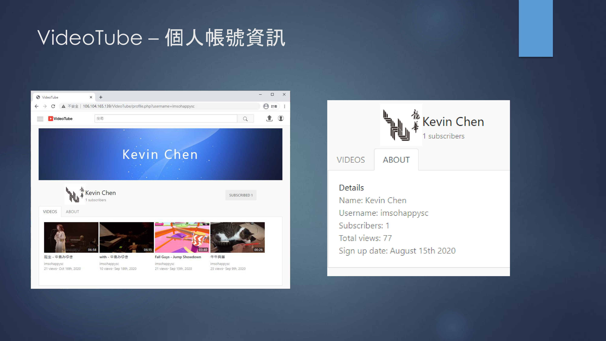
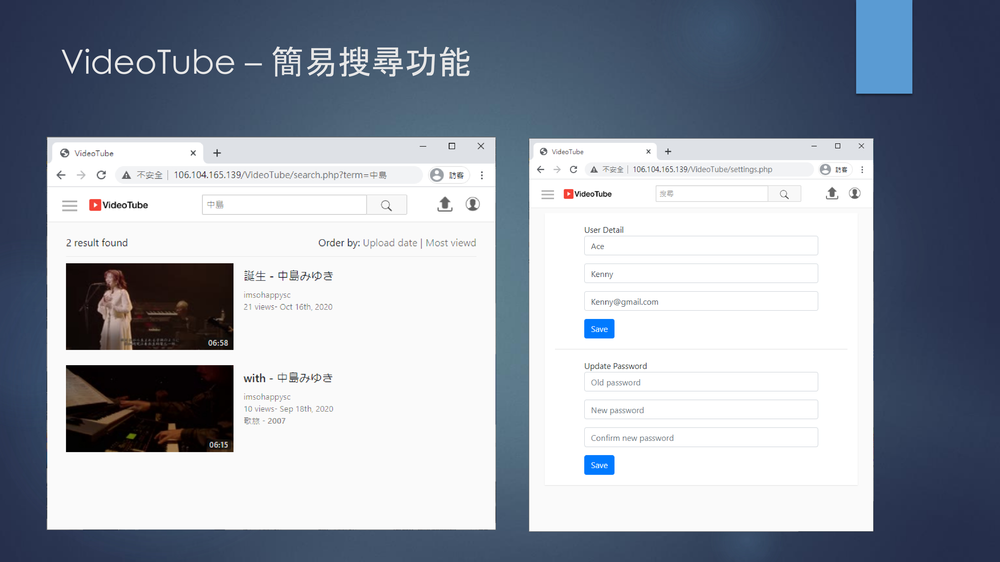

# VideoTube
A PHP YouTube clone website.
https://www.udemy.com/course/youtube-clone/

# Setup
| 7.3.21 | 5.7.31
|:---:|:---:|
 | 

#### Step1 - import sql file
```
cd reference
mysql -u [your_db_username] -p < videotube.sql
```

#### Step2 - setup config file
```
cp includes/config-example.php config.php

# config.php (example)
	define('DB_HOST', 'localhost');
	define('DB_NAME', 'videotube');
	define('DB_USERNAME', 'root');
	define('DB_PASSWORD', '');
```

# Preview
  










